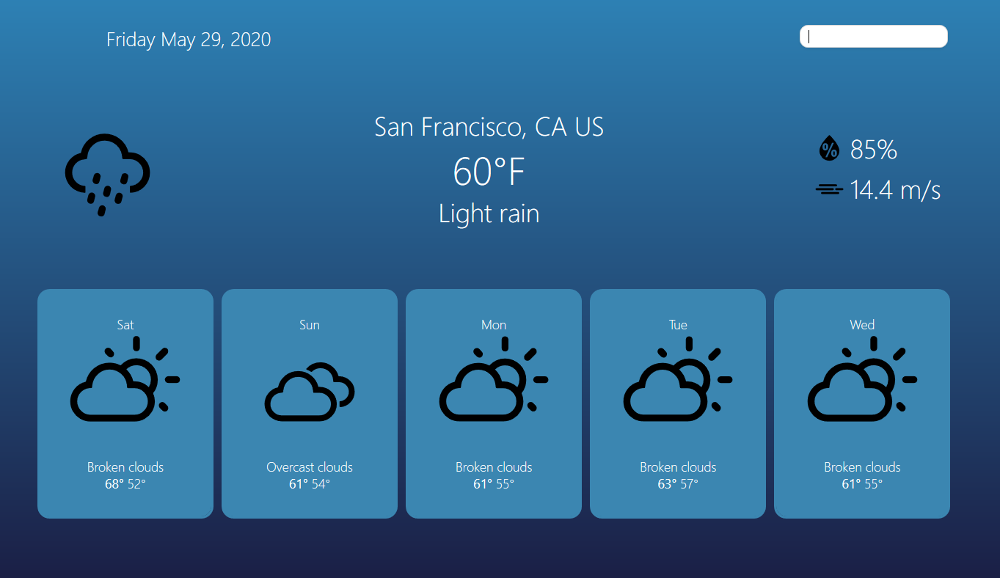
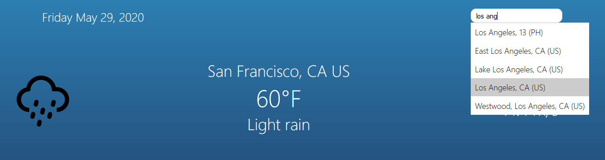
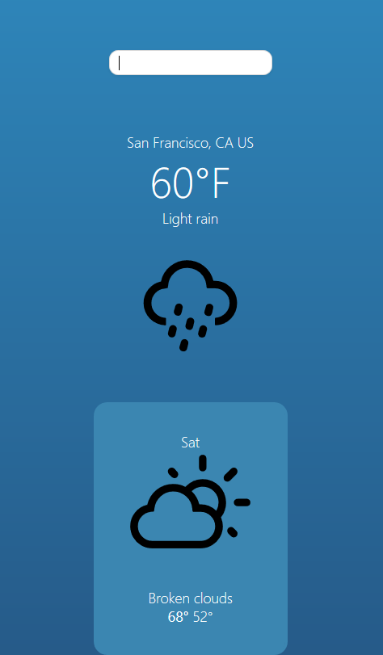

# Weatherapp-v3

The third iteration of a weather forecast app -- in react. This project is an expanded version of an assignment I received for a web programming class I took while in school. The original assignment was much simpler in that only the current weather data needed to be displayed. As the code for that version was extremely hacky (and just plain bad), I thought this would be a good opportunity to continue building my overall programming skills, as well as my skills in react -- so I decided to convert it. I've since added more functionality (future forecasts, autocomplete for locations, etc.) as well.

## Credits

[Weather Data](https://www.weatherbit.io/)

[Weather Icons](https://github.com/erikflowers/weather-icons)

[Icon Mapping](https://github.com/yohaybn/weatherbit.io-codes-to-weather-icon-mapping/blob/master/mapping.json) 